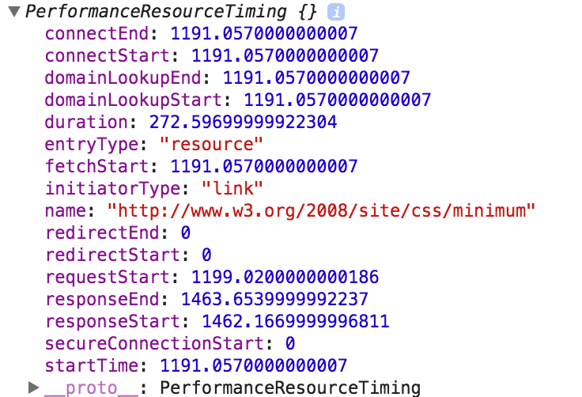

# Resource Timing

Resource Timing APIはウォーターフォールチャートより多くの詳細な情報を提供する

↓アクセス可能な属性セット


## Load Times for Resources

Resource Timingデータはwindow.performance上のメソッドとして公開されている  
リクエストされたリソースごとのResource Timingオブジェクトの配列を取得する`performance.getEntriesByType('resource')`を使うことが推奨されている



PerformanceResourceTimingインターフェースはPerformanceEntryインターフェースを拡張したもの  
Resource Timingの属性は、responseEndとstartTimeの差として測定できる

各属性のタイムスタンプはマイクロ秒単位

[ブラウザ対応](http://caniuse.com/#feat=resource-timing)

## 例

```html
<!doctype html>
<html>
  <head>
  </head>
  <body onload="loadResources()">
    <script>
       function loadResources()
       {
          var image1 = new Image();
          image1.onload = resourceTiming;
          image1.src = 'https://www.w3.org/Icons/w3c_main.png';
       }

       function resourceTiming()
       {
           var resourceList = window.performance.getEntriesByType("resource");
           for (i = 0; i < resourceList.length; i++)
           {
              if (resourceList[i].initiatorType == "img")
              {
                 alert("End to end resource fetch: " + (resourceList[i].responseEnd - resourceList[i].startTime));
              }
           }
       }
    </script>
    
  </body>
</html>
```