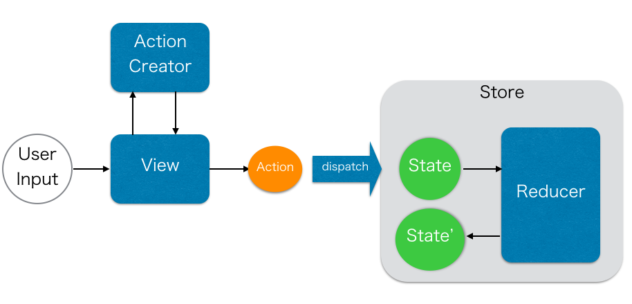
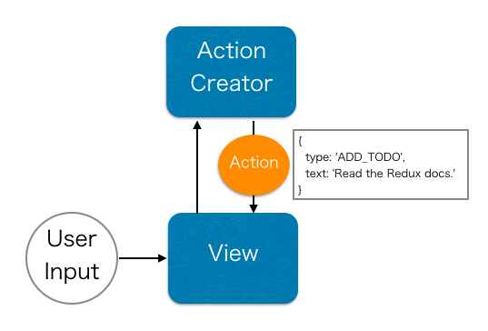
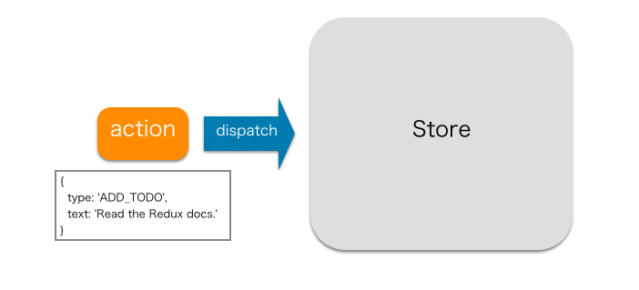
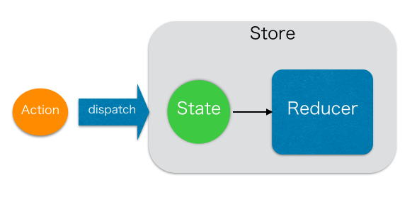
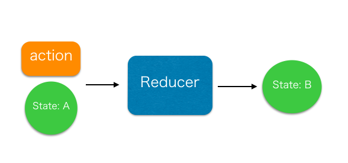
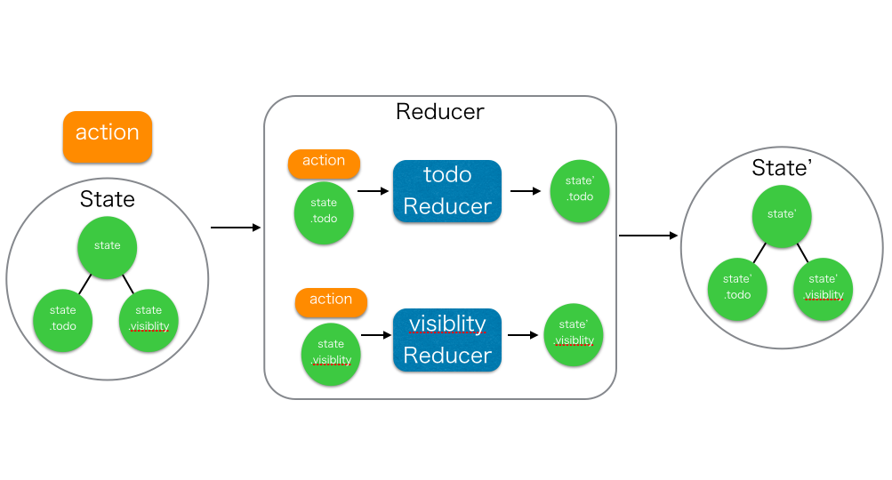
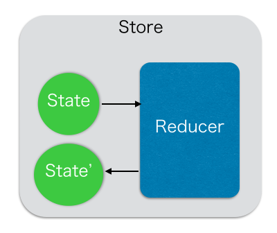

# Reduxとは

Reactが扱うUIの`state`(状態)を管理するためのフレームワーク  
Reactでは`state`を管理するデータフローに`Flux`を提案しているが、ReduxはFluxの概念を拡張して扱いやすく設計されている

# Reduxの要素

- Action
- ActionCreator
- Store
- State
- Reducer



## 1. ユーザーの入力からアクションを作成する



ユーザーがTODOテキストを入力して追加ボタンを押した場合  
ActionCreatorのメソッドに入力内容が渡されて、Actionオブジェクトを作成

Actionは「何をする」という情報を持ったオブジェクト  
Actionは`type`プロパティを必ず持つ

```
{
  type: 'ADD_TODO',
  text: 'Build my first Redux app'
}
```

ActionCreatorはActionを作成するメソッド  
FluxのActionCreatorとは違い、Actionを作るのみでStoreへのdispatchは行わない

```javascript
function addTodo(text) {
  return {
    type: 'ADD_TODO',
    text
  }
}
```

## 2. StoreへActionをdispatchする



ActionCreatorで生成されたActionをStoreへdispatchする  
Storeのインスタンスにdispatch(action)を行うことでStoreへ変更を伝える

```javascript
dipatch(addTodo(text))
```

Storeはアプリケーションの状態(state)を保持している場所  
Storeはアプリケーション内で１つ存在し、１つのstateを保持

Storeの役割
- stateを保持
- stateへアクセスするための`getState()`を提供
- stateを更新するための`dispatch(action)`を提供
- リスナーを登録するための`subscribe(listener)`を提供

Stateはアプリケーションの状態を表す  
内容が複雑になる場合は、ネストしたツリー上の構造で表す

```
{
  visibilityFilter: 'SHOW_ALL',
  todos: [
    {
      text: 'Consider using Redux',
      completed: true,
    },
    {
      text: 'Keep all state in a single tree',
      completed: false
    }
  ]
}
```

## 3. dispatchされたactionとstateをReducerへ渡す



Storeは、Storeを作成する際にStateを変更するためのメソッドであるReducerを1つ登録する
Storeはdispatchされると、引数のactionと現在保持しているStateをReducerへ渡し、新しいStateを作成する

```javascript
import { createStore } from 'redux';
import todoApp from './reducer';
let store = createStore(todoApp);
```

Reducerはactionとstateから、新しいstateを作成して返すメソッド  
引数のstateを更新せず、新しいstateを作成して返す  
Reducerは副作用を起こさないpureな関数でなければならず、Aというstateに対してBというstateを返す関数でなければならない



Reducerの実装はActionのtypeに応じて処理を書く

```javascript
function todoApp(state = initialState, action) {
  switch (action.type) {
    case SET_VISIBILITY_FILTER:
      return Object.assign({}, state, {
        visibilityFilter: action.filter
      })
    case ADD_TODO:
      return Object.assign({}, state, {
        todos: [
          ...state.todos,
          {
            text: action.text,
            completed: false
          }
        ]
      })
    case COMPLETE_TODO:
      return Object.assign({}, state, {
        todos: [
        ...state.todos.slice(0, action.index),
        Object.assign({}, state.todos[action.index],{
        completed: true
      }),
      ...state.todos.slice(action.index + 1)
    ]
  }) 
    default:
      return state
  }
}
```

Reducerはアプリケーションが大きくなるに従って肥大化してしまうので  
Reducer内に子Reducerを作成し、stateプロパティごとに子Reducerで処理するようにする



```javascript
function todos(state = [], action) {
  switch (action.type) {
    case ADD_TODO:
      return [
        ...state,
        {
          text: action.text,
          completed: false
        }
      ]
    case COMPLETE_TODO:
      return [
        ...state.slice(0, action.index),
        Object.assign({}, state[action.index], {
          completed: true
        }),
        ...state.slice(action.index + 1)
      ]
    default:
      return state
  }
}

function visibilityFilter(state = SHOW_ALL, action) {
  switch (action.type) {
    case SET_VISIBILITY_FILTER:
      return action.filter
    default:
      return state
  }
}

function todoApp(state = {}, action) {
  return {
    visibilityFilter: visibilityFilter(state.visibilityFilter, action),
    todos: todos(state.todos, action)
  }
}
```

## 4. Reducerが作成した新しいstateをStoreが保存する



Reducerによって新しいStateが作成され、Storeは現在の代わりに保持する

# Reduxの3原則

## 1. Single source of truth

アプリケーション内でStoreは1つのみとし、Stateは単独のオブジェクトとしてStoreに保持される。

## 2. State is read-only

Stateを直接変更することはできず、actionをStoreへdispatchすることでしかStateは変更できない。

## 3. Mutations are written as pure functions

Stateを変更する関数(Reducer)はpureな関数にする。


